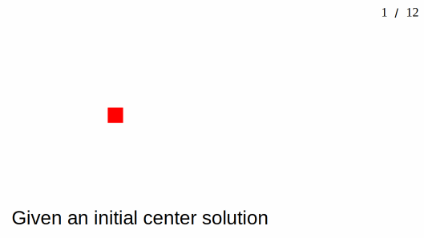

# PGPElib
A mini library for **P**olicy **G**radients with **P**arameter-based **E**xploration [[1](#references)] _and friends_. 

This library serves as a clean re-implementation of the algorithms used in our relevant [paper](https://arxiv.org/abs/2008.02387).

## Introduction 

PGPE is an algorithm for computing approximate policy gradients for Reinforcement Learning (RL) problems.
`pgpelib` provides a clean, scalable and easily extensible implementation of PGPE, and also serves as a reference (re)implementation of **ClipUp** [[2](#references)], an optimizer designed to work specially well with PGPE-style gradient estimation.
Although they were developed in the context of RL, both PGPE and ClipUp are general purpose tools for solving optimization problems.

Here are some interesting RL agents trained in simulation with the [PGPE+ClipUp](#what-is-clipup) implementation in `pgpelib`.

<table>
    <tr>
        <td>HumanoidBulletEnv-v0<br />Score: 4853</td>
        <td>
            
        </td>
    <tr>
    </tr>
        <td>Humanoid-v2<br />Score: 10184</td>
        <td>
            
        </td>
    <tr>
    </tr>
        <td>Walker2d-v2<br />Score: 5232</td>
        <td>
            
        </td>
    </tr>
</table>

## Contents

* [Introduction](#introduction)
* [Contents](#contents)
* [What is PGPE?](#what-is-pgpe)
* [What is ClipUp?](#what-is-clipup)
* [Installation](#installation)
* [Usage](#usage)
  * [Basic usage](#basic-usage)
  * [Parallelization](#parallelization)
  * [Training RL agents](#training-rl-agents)
* [License](#license)
* [References](#references)
* [Citation](#citation)
* [Acknowledgements](#acknowledgements)

## What is PGPE?

PGPE is a derivative-free policy gradient estimation algorithm. 
More generally, it can be seen as a distribution-based evolutionary algorithm suitable for optimization in the domain of real numbers.
With simple modifications to PGPE, one can also obtain similar algorithms like OpenAI-ES [[3](#references)] and Augmented Random Search [[7](#references)].

Please see the following animation for a visual explanation of how PGPE works.



[Back to Contents](#contents)

---- 

## What is ClipUp?

ClipUp is a new _optimizer_ (a gradient following algorithm) that we propose in [[2](#references)] for use within distribution-based evolutionary algorithms such as PGPE.
In [[3, 4](#references)], it was shown that distribution-based evolutionary algorithms work well with adaptive optimizers. 
In those studies, the authors used the well-known Adam optimizer [[5](#references)].
We argue that ClipUp is simpler and more intuitive, yet competitive with Adam.
Please see our [blog post](https://rupeshks.cc/projects/clipup.html) and paper [[2](#references)] for more details.

[Back to Contents](#contents)

## Installation

**Pre-requisites**: `swig` is a pre-requisite for _Box2D_, a simple physics engine used for some RL examples.
It can be installed either system-wide (using a package manager like `apt`) or using `conda`.
Then you can install `pgpelib` using following commands:

```bash
# Install directly from GitHub
pip install git+https://github.com/nnaisense/pgpelib.git#egg=pgpelib

# Or install from source in editable mode (to run examples or to modify code)
git clone https://github.com/nnaisense/pgpelib.git
cd pgpelib
pip install -e .
```

If you wish to run experiments based on _MuJoCo_, you will need some additional setup.
See [this link](https://spinningup.openai.com/en/latest/user/installation.html#installing-mujoco-optional) for setup instructions.

[Back to Contents](#contents)

## Usage

To dive into executable code examples, please see [the `examples` directory](examples/).
Below we give a very quick tutorial on how to use `pgpelib` for optimization.

### Basic usage

`pgpelib` provides an ask-and-tell interface for optimization, similar to [[4, 6](#references)].
The general principle is to repeatedly _ask_ the optimizer for candidate solutions to evaluate, and then _tell_ it the corresponding fitness values so it can update the current solution or population.
Using this interface, a typical communication with the solver is as follows:

```python
from pgpelib import PGPE
import numpy as np

pgpe = PGPE(
    solution_length=5,   # A solution vector has the length of 5
    popsize=20,          # Our population size is 20

    #optimizer='clipup',          # Uncomment these lines if you
    #optimizer_config = dict(     # would like to use the ClipUp
    #    max_speed=...,           # optimizer.
    #    momentum=0.9
    #),

    #optimizer='adam',            # Uncomment these lines if you
    #optimizer_config = dict(     # would like to use the Adam
    #    beta1=0.9,               # optimizer.
    #    beta2=0.999,
    #    epsilon=1e-8
    #),

    ...
)

# Let us run the evolutionary computation for 1000 generations
for generation in range(1000):

    # Ask for solutions, which are to be given as a list of numpy arrays.
    # In the case of this example, solutions is a list which contains
    # 20 numpy arrays, the length of each numpy array being 5.
    solutions = pgpe.ask()

    # This is the phase where we evaluate the solutions
    # and prepare a list of fitnesses.
    # Make sure that fitnesses[i] stores the fitness of solutions[i].
    fitnesses = [...]  # compute the fitnesses here

    # Now we tell the result of our evaluations, fitnesses,
    # to our solver, so that it updates the center solution
    # and the spread of the search distribution.
    pgpe.tell(fitnesses)

# After 1000 generations, we print the center solution.
print(pgpe.center)
```

`pgpelib` also supports **adaptive population sizes**, where additional solutions are sampled from the current search distribution and evaluated until a certain number of total simulator interactions (i.e. timesteps) is reached.
Use of this technique can be enabled by specifying the `num_interactions` parameter, as demonstrated by the following snippet:

```python
pgpe = PGPE(
    solution_length=5,      # Our RL policy has 5 trainable parameters.
    popsize=20,             # Our base population size is 20.
                            # After evaluating a batch of 20 policies,
                            # if we do not reach our threshold of
                            # simulator interactions, we will keep sampling
                            # and evaluating more solutions, 20 at a time,
                            # until the threshold is finally satisfied.

    num_interactions=17500, # Threshold for simulator interactions.
    ...
)

# Let us run the evolutionary computation for 1000 generations
for generation in range(1000):

    # We begin the inner loop of asking for new solutions,
    # until the threshold of interactions count is reached.
    while True:

        # ask for new policies to evaluate in the simulator
        solutions = pgpe.ask()

        # This is the phase where we evaluate the policies,
        # and prepare a list of fitnesses and a list of
        # interaction counts.
        # Make sure that:
        #   fitnesses[i] stores the fitness of solutions[i];
        #   interactions[i] stores the number of interactions
        #       made with the simulator while evaluating the
        #       i-th solution.
        fitnesses = [...]
        interactions = [...]

        # Now we tell the result of our evaluations
        # to our solver, so that it updates the center solution
        # and the spread of the search distribution.
        interaction_limit_reached = pgpe.tell(fitnesses, interactions)

        # If the limit on number of interactions per generation is reached,
        # pgpelib has already updated the search distribution internally.
        # So we can stop creating new solutions and end this generation.
        if interaction_limit_reached:
            break

# After 1000 generations, we print the center solution (policy).
print(pgpe.center)
```

### Parallelization

Ease of parallelization is a massive benefit of evolutionary search techniques.
`pgpelib` is thoughtfully agnostic when it comes to parallelization: the choice of tool used for parallelization is left to the user.
We provide thoroughly documented examples of using either [multiprocessing](examples/03-rl-multiprocessing.py) or [ray](examples/04-rl-ray.py) for parallelizing evaluations across multiple cores on a single machine or across multiple machines.
The `ray` example additionally demonstrates use of _observation normalization_ when training RL agents.

### Training RL agents

This repository also contains a Python script for training RL agents.
The training script is configurable and executable from the command line.
See the [`train_agents` directory](train_agents/).
Some pre-trained RL agents are also available for visualization in the [`agents` directory](agents/).

[Back to Contents](#contents)

## License

Please see: [LICENSE](LICENSE).

The files [optimizers.py](pgpelib/optimizers.py), [runningstat.py](pgpelib/runningstat.py), and [ranking.py](pgpelib/ranking.py) contain codes adapted from OpenAI's [evolution-strategies-starter](https://github.com/openai/evolution-strategies-starter) repository.
The license terms of those adapted codes can be found in their files.

[Back to Contents](#contents)

## References

`[1]`
Sehnke, F., Osendorfer, C., Rückstieß, T., Graves, A., Peters, J., & Schmidhuber, J. (2010).
[Parameter-exploring policy gradients](http://people.idsia.ch/~juergen/nn2010.pdf). 
Neural Networks, 23(4), 551-559.

`[2]`
Toklu, N.E., Liskowski, P., & Srivastava, R.K. (2020).
[ClipUp: A Simple and Powerful Optimizer for Distribution-based Policy Evolution](https://arxiv.org/abs/2008.02387).
16th International Conference on Parallel Problem Solving from Nature (PPSN 2020).

`[3]`
Salimans, T., Ho, J., Chen, X., Sidor, S., & Sutskever, I. (2017).
[Evolution strategies as a scalable alternative to reinforcement learning](https://arxiv.org/abs/1703.03864). 
arXiv preprint arXiv:1703.03864.

`[4]`
Ha, D. (2017). [A Visual Guide to Evolution Strategies](https://blog.otoro.net/2017/10/29/visual-evolution-strategies/).

`[5]`
Kingma, D.P., & Ba, J. (2015). [Adam: A method for stochastic optimization](https://arxiv.org/abs/1412.6980).
In Proceedings of 3rd International Conference on Learning Representations (ICLR 2015).

`[6]`
Hansen, N., Akimoto, Y., Baudis, P. (2019). [CMA-ES/pycma on Github](https://github.com/CMA-ES/pycma). Zenodo, DOI:10.5281/zenodo.2559634, February 2019.

`[7]`
Mania, H., Guy, A., & Recht, B. (2018). [Simple random search provides a competitive approach to reinforcement learning](https://arxiv.org/abs/1803.07055) 
arXiv preprint arXiv:1803.07055. 

[Back to Contents](#contents)

## Citation

If you use this code, please cite us in your repository/paper as:
 
```
Toklu, N. E., Liskowski, P., & Srivastava, R. K. (2020, September). ClipUp: A Simple and Powerful Optimizer for Distribution-Based Policy Evolution. In International Conference on Parallel Problem Solving from Nature (pp. 515-527). Springer, Cham.
```

Bibtex:
```
@inproceedings{toklu2020clipup,
  title={ClipUp: A Simple and Powerful Optimizer for Distribution-Based Policy Evolution},
  author={Toklu, Nihat Engin and Liskowski, Pawe{\l} and Srivastava, Rupesh Kumar},
  booktitle={International Conference on Parallel Problem Solving from Nature},
  pages={515--527},
  year={2020},
  organization={Springer}
}
```

[Back to Contents](#contents)

## Acknowledgements

We are thankful to developers of these tools for inspiring this implementation.

- [pycma](https://github.com/CMA-ES/pycma)
- [evolution-strategies-starter](https://github.com/openai/evolution-strategies-starter)
- [estool](https://github.com/hardmaru/estool)
- [ARS](https://github.com/modestyachts/ARS)

[Back to Contents](#contents)

